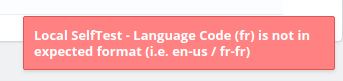
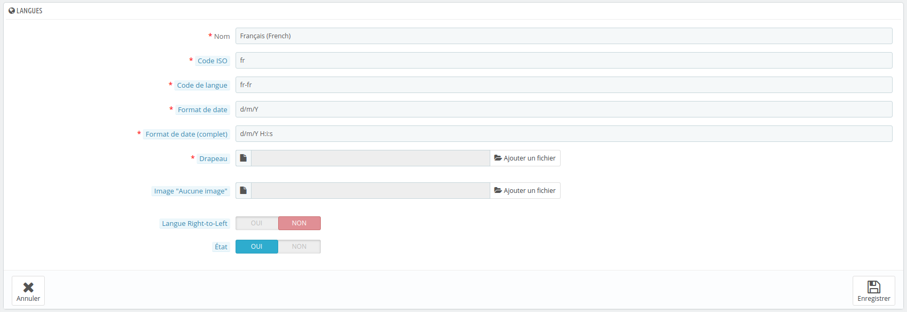

## Questions fréquentes {.faq}

### Les autotests échouent avec « Language Code is not in expected format »

Les packages PrestaShop préconfigurés peuvent utiliser des codes de langue incomplets, or Splash a besoin
de codes ISO complets pour identifier les langues de vos champs multilingues. L'erreur est affichée sur la
page de configuration du module.

Allez dans **International > Localisation > Langues**, modifiez chaque langue et remplacez son
**Code de langue** par un format complet :

| Code actuel | Code attendu |
|---|---|
| `en` | `en-us` |
| `es` | `es-es` |
| `fr` | `fr-fr` |
| `it` | `it-it` |

### Mes autres applications ne reçoivent pas toutes les langues de mes produits

Les produits PrestaShop utilisent des champs multilingues. Vérifiez que les applications que vous
synchronisez supportent les champs multilingues, ou associez la langue souhaitée dans vos schémas de
synchronisation. Contactez notre support si vous avez des difficultés à configurer votre synchronisation.

### Les nouveaux produits créés sur Splash ne sont pas créés dans PrestaShop

Par défaut, le module n'exporte que les nouveaux produits de PrestaShop vers Splash. Les noms de produits
envoyés par PrestaShop incluent les options de la déclinaison, afin que chaque variante ait son propre nom.

Pour autoriser la création de produits depuis Splash, mettez à jour vos schémas de synchronisation et
ajoutez un export vers le champ **Product Name without Options** : il indique à Splash où le nom du
produit doit être écrit.

### Les commandes ou factures modifiées dans mon ERP ne sont pas mises à jour dans PrestaShop

C'est normal : les commandes et factures clients sont en **lecture seule**. Elles sont exportées de
PrestaShop vers vos autres applications, jamais réécrites.

### Certains paiements sont exportés avec un mauvais moyen de paiement

Associez chaque module de paiement à un moyen de paiement générique Splash dans le bloc
**Payments Methods Settings**. Un module de paiement n'y apparaît qu'une fois qu'une première commande a été
passée avec lui. Voir **Détection des moyens de paiement** pour le processus complet.
