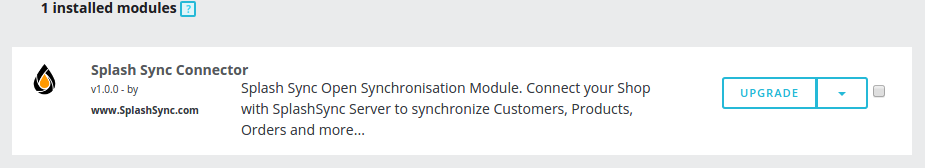
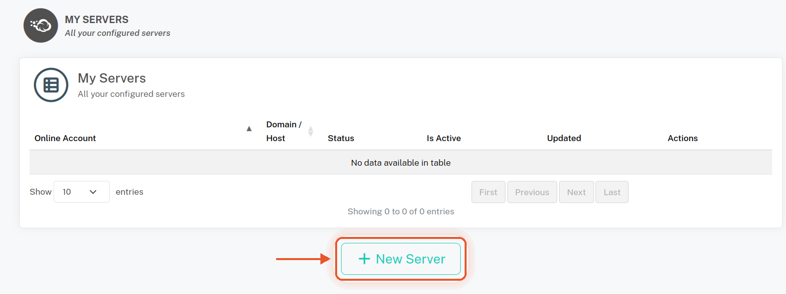
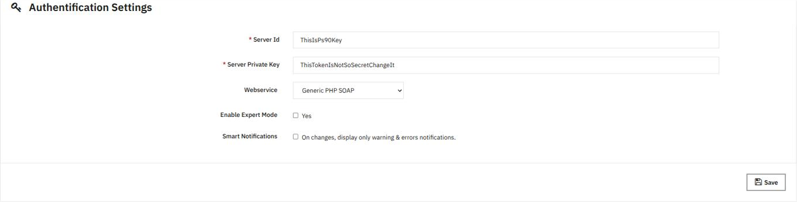
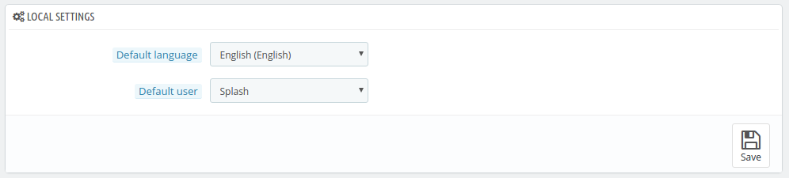
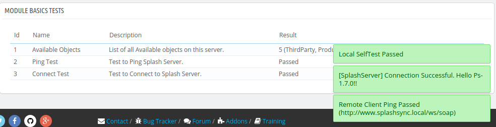

### Open the module configuration

In your back office, go to **Modules > Module Manager**, search for **Splash Sync Connector** and click
**Configure**.

### Create your server keys on Splash

Each PrestaShop store is declared as a **server** in your Splash account. On the Splash workspace, go to
**My Servers**, click **New Server** and write down the **identifier** and the **encryption key** of the new server.

### Enter the keys in the module

In the **Authentication Settings** block of the module configuration, fill in:

| Setting | Value |
|---|---|
| Server Id | the server identifier given by Splash |
| Server Private Key | the encryption key given by Splash |

> [!WARNING]
> Copy the keys carefully: a single missing character and the connection fails. Never share the private key.

### Select the default user

In the **Local Settings** block, select the **Default user**: the employee used for all actions performed
by Splash. We highly recommend a **dedicated employee** for Splash: PrestaShop rights policy applies, so this
user must have the appropriate permissions.

> [!NOTE]
> The PrestaShop default language is used as reference language. All installed languages are synchronized
> through multilingual fields.

### Check the self-tests

Each time you save the configuration, the module checks your parameters and the communication with Splash.

> [!IMPORTANT]
> All tests must pass: this is critical! Once green, your store appears as connected on your Splash account.
